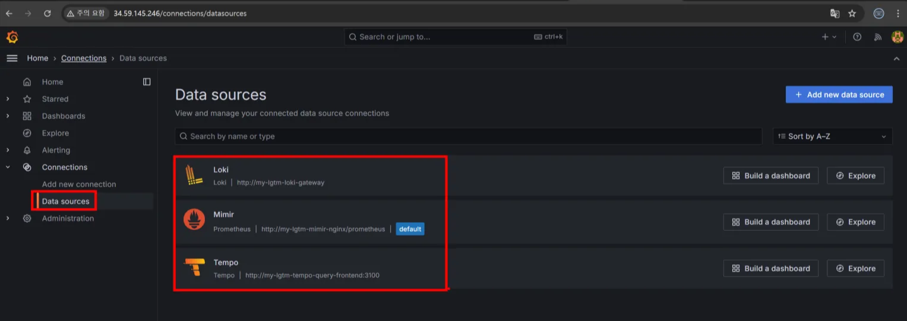
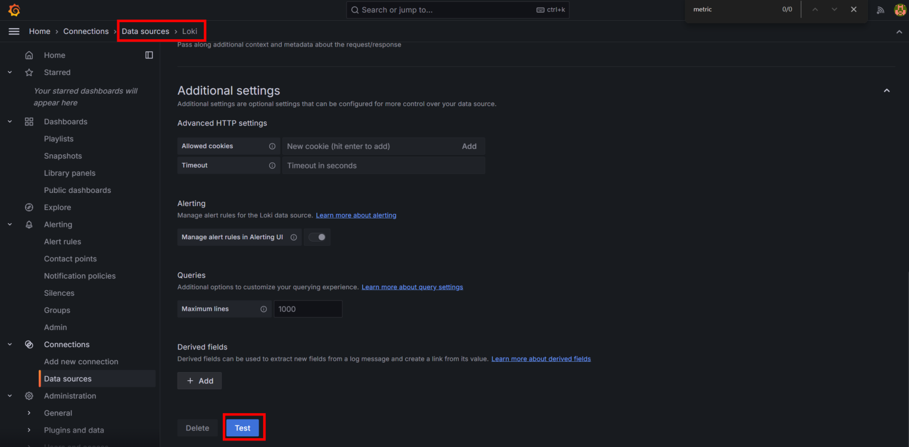

# kubernetes 환경에서 otel + LGTM 구성하기

## 통합 관측성의 장점

- **One Dashboard**: Grafana 하나에서 **통합 로그·메트릭·트레이스**를 조회
- **Tracing to Logs**: 트레이스 조회 화면에서 **해당 span의 로그**로 바로 점프 가능
- **Tracing to Metrics**: 특정 트레이스의 **지표(예: error rate)**를 연계 분석
- **Alerting**: 실시간 알림 연동 및 다양한 Alert Rule 지원

## 1. 시작 전 알아두기

관측성(Observability)은 애플리케이션의 내부 상태를 **로그(Logs), 메트릭(Metrics), 트레이스(Traces)**를 통해 실시간으로 파악하는 DevOps의 핵심 개념입니다.

**OpenTelemetry**(OTel)는 이 세 가지 신호(Signal)를 지원하는 오픈소스 표준으로, **LGTM 스택**(Loki, Grafana, Tempo, Mimir)은 각각 로그·메트릭·트레이스를 저장·조회·시각화하는 서버리스/스케일아웃 백엔드입니다.

이 실습에서는 **쿠버네티스 환경**에서 OTel Collector가 애플리케이션으로부터 수집한 데이터를

- *Loki(로그), Mimir(메트릭), Tempo(트레이스)**에 각각 저장하게 하며,

Grafana에서 원클릭 커버리지로 관측성 데이터를 시각화합니다.

https://github.com/grafana/helm-charts/blob/main/charts/grafana/README.md

## 2. 시작하기 전

- **쿠버네티스 클러스터**가 준비되어야 하며,
    
    **kubectl, helm**은 설치되어 있어야 합니다.
    
- **Helm**을 통해 배포할 것이므로,
    
    Grafana Helm 차트 저장소를 먼저 추가합니다.
    
    ```bash
    helm repo add grafana https://grafana.github.io/helm-charts
    helm repo update
    ```
    
- **네임스페이스와 Helm 리포지토리**
    
    별도의 네임스페이스(lgtm)에서 LGTM 스택을 설치합니다.
    
    (--create-namespace 옵션으로 미존재 시 자동생성)
    

## 3. LGTM 스택 (Loki, Graphana, Tempo, Mimir) 배포

최신 Grafana Helm 차트 기반의 **`lgtm-distributed`**는

**모든 백엔드(Loki, Mimir, Tempo)가 스케일아웃/HA/분산처리 구조**로 동작합니다.

```bash
helm upgrade --install my-lgtm grafana/lgtm-distributed -n lgtm --create-namespace \
  --set tempo.ingester.replicas=2 # 2개로 설정하지 않으면 정상동작하지 않음 
```

<aside>
💡

**여기서 중요한 점!**

**Tempo의 Ingester 파드는 최소 2개(replica) 이상**이어야 데이터가 안전하게 저장됩니다. 기본값은 1로, **실수하는 사람이 매우 많습니다**. 배포 명령에 **추가 옵션**을 넣어 replica 수를 적정(2~3)으로 늘려주세요.

</aside>

## 4. Deployment 상태 확인

배포 후, **모든 파드가 RUNNING** 상태인지 확인합니다.

CrashLoopBackOff, Not Ready, Evicted 등 비정상 상태가 없다면 OK.

```bash
$ kubectl get all,secret,cm,sa -n lgtm
NAME                                                    READY   STATUS      RESTARTS   AGE
pod/my-lgtm-grafana-796c687467-9744r                    1/1     Running     0          105s
pod/my-lgtm-loki-distributor-6d48d46cd7-nhpr5           1/1     Running     0          107s
pod/my-lgtm-loki-gateway-774d5f7777-qs9m5               1/1     Running     0          105s
pod/my-lgtm-loki-ingester-0                             1/1     Running     0          106s
pod/my-lgtm-loki-querier-0                              1/1     Running     0          106s
pod/my-lgtm-loki-query-frontend-7fbd467d6c-nt46m        1/1     Running     0          103s
pod/my-lgtm-mimir-alertmanager-0                        1/1     Running     0          105s
pod/my-lgtm-mimir-compactor-0                           1/1     Running     0          105s
pod/my-lgtm-mimir-distributor-6bf7bc58d6-bf7z7          1/1     Running     0          105s
pod/my-lgtm-mimir-ingester-0                            1/1     Running     0          105s
pod/my-lgtm-mimir-ingester-1                            1/1     Running     0          103s
pod/my-lgtm-mimir-make-minio-buckets-5.0.14-x7qt8       0/1     Completed   1          104s
pod/my-lgtm-mimir-nginx-648f78fff8-5p2nt                1/1     Running     0          106s
pod/my-lgtm-mimir-overrides-exporter-54c7c68875-4n5lv   1/1     Running     0          107s
pod/my-lgtm-mimir-querier-84748d5456-b88ns              1/1     Running     0          106s
pod/my-lgtm-mimir-query-frontend-7d6bb979c7-67stp       1/1     Running     0          107s
pod/my-lgtm-mimir-query-scheduler-d7987994d-j52kc       1/1     Running     0          103s
pod/my-lgtm-mimir-ruler-66dcbbf594-l6lqk                1/1     Running     0          103s
pod/my-lgtm-mimir-store-gateway-0                       1/1     Running     0          103s
pod/my-lgtm-minio-977d679c9-jkk5w                       1/1     Running     0          107s
pod/my-lgtm-rollout-operator-559d7f7d78-f6s2m           1/1     Running     0          102s
pod/my-lgtm-tempo-compactor-6497cbc849-rhfqp            1/1     Running     0          103s
pod/my-lgtm-tempo-distributor-69dc8d985-dgkdp           1/1     Running     0          107s
pod/my-lgtm-tempo-ingester-0                            1/1     Running     0          105s
pod/my-lgtm-tempo-memcached-0                           1/1     Running     0          106s
pod/my-lgtm-tempo-querier-b89649cf7-8ncpj               1/1     Running     0          106s
pod/my-lgtm-tempo-query-frontend-57684dd87f-xb2r4       1/1     Running     0          103s

NAME                                             TYPE        CLUSTER-IP       EXTERNAL-IP   PORT(S)                      AGE
service/my-lgtm-grafana                          ClusterIP   34.118.237.233   <none>        80/TCP                       110s
service/my-lgtm-loki-distributor                 ClusterIP   34.118.234.246   <none>        3100/TCP,9095/TCP            110s
service/my-lgtm-loki-gateway                     ClusterIP   34.118.234.109   <none>        80/TCP                       110s
service/my-lgtm-loki-ingester                    ClusterIP   34.118.236.69    <none>        3100/TCP,9095/TCP            110s
service/my-lgtm-loki-ingester-headless           ClusterIP   None             <none>        3100/TCP,9095/TCP            110s
service/my-lgtm-loki-memberlist                  ClusterIP   None             <none>        7946/TCP                     110s
service/my-lgtm-loki-querier                     ClusterIP   34.118.236.220   <none>        3100/TCP,9095/TCP            110s
service/my-lgtm-loki-querier-headless            ClusterIP   None             <none>        3100/TCP,9095/TCP            110s
service/my-lgtm-loki-query-frontend              ClusterIP   34.118.231.26    <none>        3100/TCP,9095/TCP,9096/TCP   110s
service/my-lgtm-loki-query-frontend-headless     ClusterIP   None             <none>        3100/TCP,9095/TCP,9096/TCP   110s
service/my-lgtm-mimir-alertmanager               ClusterIP   34.118.228.121   <none>        8080/TCP,9095/TCP            110s
service/my-lgtm-mimir-alertmanager-headless      ClusterIP   None             <none>        8080/TCP,9095/TCP,9094/TCP   110s
service/my-lgtm-mimir-compactor                  ClusterIP   34.118.226.175   <none>        8080/TCP,9095/TCP            110s
service/my-lgtm-mimir-distributor                ClusterIP   34.118.235.60    <none>        8080/TCP,9095/TCP            110s
service/my-lgtm-mimir-distributor-headless       ClusterIP   None             <none>        8080/TCP,9095/TCP            110s
service/my-lgtm-mimir-gossip-ring                ClusterIP   None             <none>        7946/TCP                     110s
service/my-lgtm-mimir-ingester                   ClusterIP   34.118.235.167   <none>        8080/TCP,9095/TCP            110s
service/my-lgtm-mimir-ingester-headless          ClusterIP   None             <none>        8080/TCP,9095/TCP            110s
service/my-lgtm-mimir-nginx                      ClusterIP   34.118.233.98    <none>        80/TCP                       109s
service/my-lgtm-mimir-overrides-exporter         ClusterIP   34.118.225.157   <none>        8080/TCP,9095/TCP            110s
service/my-lgtm-mimir-querier                    ClusterIP   34.118.225.207   <none>        8080/TCP,9095/TCP            110s
service/my-lgtm-mimir-query-frontend             ClusterIP   34.118.231.35    <none>        8080/TCP,9095/TCP            109s
service/my-lgtm-mimir-query-scheduler            ClusterIP   34.118.229.101   <none>        8080/TCP,9095/TCP            110s
service/my-lgtm-mimir-query-scheduler-headless   ClusterIP   None             <none>        8080/TCP,9095/TCP            110s
service/my-lgtm-mimir-ruler                      ClusterIP   34.118.225.77    <none>        8080/TCP                     110s
service/my-lgtm-mimir-store-gateway              ClusterIP   34.118.237.183   <none>        8080/TCP,9095/TCP            110s
service/my-lgtm-mimir-store-gateway-headless     ClusterIP   None             <none>        8080/TCP,9095/TCP            110s
service/my-lgtm-minio                            ClusterIP   34.118.238.1     <none>        9000/TCP                     110s
service/my-lgtm-minio-console                    ClusterIP   34.118.226.174   <none>        9001/TCP                     110s
service/my-lgtm-tempo-compactor                  ClusterIP   34.118.234.136   <none>        3100/TCP                     110s
service/my-lgtm-tempo-distributor                ClusterIP   34.118.230.41    <none>        3100/TCP,9095/TCP            110s
service/my-lgtm-tempo-distributor-discovery      ClusterIP   None             <none>        3100/TCP                     110s
service/my-lgtm-tempo-gossip-ring                ClusterIP   None             <none>        7946/TCP                     110s
service/my-lgtm-tempo-ingester                   ClusterIP   34.118.231.235   <none>        3100/TCP,9095/TCP            110s
service/my-lgtm-tempo-ingester-discovery         ClusterIP   None             <none>        3100/TCP,9095/TCP            110s
service/my-lgtm-tempo-memcached                  ClusterIP   34.118.225.116   <none>        11211/TCP,9150/TCP           110s
service/my-lgtm-tempo-querier                    ClusterIP   34.118.239.193   <none>        3100/TCP,9095/TCP            110s
service/my-lgtm-tempo-query-frontend             ClusterIP   34.118.229.73    <none>        3100/TCP,9095/TCP            110s
service/my-lgtm-tempo-query-frontend-discovery   ClusterIP   None             <none>        3100/TCP,9095/TCP,9096/TCP   110s

NAME                                               READY   UP-TO-DATE   AVAILABLE   AGE
deployment.apps/my-lgtm-grafana                    1/1     1            1           109s
deployment.apps/my-lgtm-loki-distributor           1/1     1            1           109s
deployment.apps/my-lgtm-loki-gateway               1/1     1            1           109s
deployment.apps/my-lgtm-loki-query-frontend        1/1     1            1           109s
deployment.apps/my-lgtm-mimir-distributor          1/1     1            1           109s
deployment.apps/my-lgtm-mimir-nginx                1/1     1            1           109s
deployment.apps/my-lgtm-mimir-overrides-exporter   1/1     1            1           109s
deployment.apps/my-lgtm-mimir-querier              1/1     1            1           109s
deployment.apps/my-lgtm-mimir-query-frontend       1/1     1            1           109s
deployment.apps/my-lgtm-mimir-query-scheduler      1/1     1            1           109s
deployment.apps/my-lgtm-mimir-ruler                1/1     1            1           109s
deployment.apps/my-lgtm-minio                      1/1     1            1           109s
deployment.apps/my-lgtm-rollout-operator           1/1     1            1           109s
deployment.apps/my-lgtm-tempo-compactor            1/1     1            1           109s
deployment.apps/my-lgtm-tempo-distributor          1/1     1            1           109s
deployment.apps/my-lgtm-tempo-querier              1/1     1            1           109s
deployment.apps/my-lgtm-tempo-query-frontend       1/1     1            1           109s

NAME                                                          DESIRED   CURRENT   READY   AGE
replicaset.apps/my-lgtm-grafana-796c687467                    1         1         1       109s
replicaset.apps/my-lgtm-loki-distributor-6d48d46cd7           1         1         1       110s
replicaset.apps/my-lgtm-loki-gateway-774d5f7777               1         1         1       109s
replicaset.apps/my-lgtm-loki-query-frontend-7fbd467d6c        1         1         1       108s
replicaset.apps/my-lgtm-mimir-distributor-6bf7bc58d6          1         1         1       109s
replicaset.apps/my-lgtm-mimir-nginx-648f78fff8                1         1         1       110s
replicaset.apps/my-lgtm-mimir-overrides-exporter-54c7c68875   1         1         1       110s
replicaset.apps/my-lgtm-mimir-querier-84748d5456              1         1         1       109s
replicaset.apps/my-lgtm-mimir-query-frontend-7d6bb979c7       1         1         1       110s
replicaset.apps/my-lgtm-mimir-query-scheduler-d7987994d       1         1         1       108s
replicaset.apps/my-lgtm-mimir-ruler-66dcbbf594                1         1         1       108s
replicaset.apps/my-lgtm-minio-977d679c9                       1         1         1       110s
replicaset.apps/my-lgtm-rollout-operator-559d7f7d78           1         1         1       108s
replicaset.apps/my-lgtm-tempo-compactor-6497cbc849            1         1         1       108s
replicaset.apps/my-lgtm-tempo-distributor-69dc8d985           1         1         1       110s
replicaset.apps/my-lgtm-tempo-querier-b89649cf7               1         1         1       109s
replicaset.apps/my-lgtm-tempo-query-frontend-57684dd87f       1         1         1       108s

NAME                                           READY   AGE
statefulset.apps/my-lgtm-loki-ingester         1/1     109s
statefulset.apps/my-lgtm-loki-querier          1/1     109s
statefulset.apps/my-lgtm-mimir-alertmanager    1/1     109s
statefulset.apps/my-lgtm-mimir-compactor       1/1     109s
statefulset.apps/my-lgtm-mimir-ingester        2/2     109s
statefulset.apps/my-lgtm-mimir-store-gateway   1/1     109s
statefulset.apps/my-lgtm-tempo-ingester        1/1     109s
statefulset.apps/my-lgtm-tempo-memcached       1/1     109s

NAME                                                STATUS     COMPLETIONS   DURATION   AGE
job.batch/my-lgtm-mimir-make-minio-buckets-5.0.14   Complete   1/1           46s        108s

NAME                                   TYPE                 DATA   AGE
secret/my-lgtm-grafana                 Opaque               3      114s
secret/my-lgtm-minio                   Opaque               2      114s
secret/sh.helm.release.v1.my-lgtm.v1   helm.sh/release.v1   1      115s

NAME                                                   DATA   AGE
configmap/kube-root-ca.crt                             1      115s
configmap/my-lgtm-grafana                              2      114s
configmap/my-lgtm-loki                                 1      114s
configmap/my-lgtm-loki-gateway                         1      114s
configmap/my-lgtm-loki-runtime                         1      114s
configmap/my-lgtm-mimir-alertmanager-fallback-config   1      114s
configmap/my-lgtm-mimir-config                         1      114s
configmap/my-lgtm-mimir-nginx                          1      114s
configmap/my-lgtm-mimir-runtime                        1      114s
configmap/my-lgtm-minio                                5      114s
configmap/my-lgtm-tempo-config                         2      114s
configmap/my-lgtm-tempo-runtime                        1      114s

NAME                                      SECRETS   AGE
serviceaccount/default                    0         115s
serviceaccount/minio-sa                   0         114s
serviceaccount/my-lgtm-grafana            0         114s
serviceaccount/my-lgtm-loki               0         114s
serviceaccount/my-lgtm-mimir              0         114s
serviceaccount/my-lgtm-rollout-operator   0         114s
serviceaccount/my-lgtm-tempo              0         114s
```

## 5. Grafana 서비스 외부 노출 및 접속

Grafana는 기본적으로 **ClusterIP** 서비스로 생성됩니다.

외부 웹브라우저에서 접속하려면 **LoadBalancer** 타입으로 변경하세요.

```jsx
kubectl patch -n lgtm svc/my-lgtm-grafana -p '{"spec": {"type":"LoadBalancer"}}'
```

외부 IP가 할당되면, 브라우저에서 **http://<EXTERNAL-IP>** 접속하세요.

```bash
$ kubectl get svc/my-lgtm-grafana -n lgtm -w
NAME              TYPE           CLUSTER-IP       EXTERNAL-IP     PORT(S)        AGE
my-lgtm-grafana   LoadBalancer   34.118.237.233   34.59.145.246   80:32433/TCP   5m39s
```

패스워드 확인합니다. 

```bash
$ kubectl get secret/my-lgtm-grafana -n lgtm -o=jsonpath='{.data.admin-password}' | base64 -d 
XVRDiDCQ88bwzkOHW9pf5Zbrn98AY4VE5oTULfby
```

# **6. LGTM 백엔드 UI 엔드포인트 정리**

**Grafana Data Sources** 세팅 시 위 내부 엔드포인트를 입력해야 합니다.



| **백엔드** | **목적** | **클러스터 내부 엔드포인트** |
| --- | --- | --- |
| Loki | 로그 저장/조회 | [http://my-lgtm-loki-gateway](http://my-lgtm-loki-gateway/) |
| Mimir | 메트릭 저장/조회 | [http://my-lgtm-mimir-nginx/prometheus](http://my-lgtm-mimir-nginx/prometheus) |
| Tempo | 트레이스 저장/조회 | [http://my-lgtm-tempo-query-frontend:3100](http://my-lgtm-tempo-query-frontend:3100/) |

# 7. OpenTelemetry Collector 배포

OTel Collector가 앱에서 → Collector → 백엔드(Loki, Mimir, Tempo)로 데이터를 구분하여 전송하게 하려면, **Helm으로 Collector를 별도 배포**하고, **ConfigMap**을 통해 각 Exporter(백엔드) 매핑을 지정합니다.

**OTel Helm 리포지토리 추가**

```jsx
helm repo add open-telemetry https://open-telemetry.github.io/opentelemetry-helm-charts
helm repo update
```

**Collectors values.yaml 설정 파일 작성**

아래는 **Loki(로그)**, **Mimir(메트릭)**,Tempo(트레이스)로 각각 데이터를 전송하는 Collector 설정 예시입니다.

아래 내용을 **otel-values.yaml** 파일로 저장하세요.

```bash
cat <<EOF > **otel-values.yaml**
mode: deployment
image:
  repository: otel/opentelemetry-collector-contrib
  tag: 0.130.0
config:
  exporters:
    loki:
      endpoint: http://my-lgtm-loki-distributor.lgtm:3100/loki/api/v1/push
    prometheusremotewrite:
      endpoint: http://my-lgtm-mimir-nginx.lgtm/api/v1/push
    otlp/tempo:
      endpoint: my-lgtm-tempo-distributor.lgtm:4317
      tls:
        insecure: true
  service:
    pipelines:
      logs:
        receivers: [otlp]
        processors: []
        exporters: [loki]
      metrics:
        receivers: [otlp]
        processors: []
        exporters: [prometheusremotewrite]
      traces:
        receivers: [otlp]
        processors: []
        exporters: [otlp/tempo]
EOF
```

**설명:**

- **Loki**: 로그 HTTP Push 엔드포인트
- **Mimir**: 메트릭 Remote Write(Prometheus 호환) 엔드포인트
- **Tempo**: 트레이스(gRPC) 엔드포인트, SSL 미사용(plaintext)
- 각각 **Pipeline**(수신→처리→내보내기)이 따로 동작합니다.

**Tempo Distibutor 서비스 포트 추가**

기존 Helm 차트로 배포된 Tempo Distibutor 서비스에는 gRPC 인바운드 포트(4317)가 없는 경우가 있으므로, **kubectl patch** 명령으로 포트를 명시적으로 추가합니다.

```bash
kubectl patch svc my-lgtm-tempo-distributor -n lgtm \
  --type='json' \
  -p='[{"op": "add", "path": "/spec/ports/-", "value": {"name": "otlp-grpc", "port": 4317, "targetPort": 4317, "protocol": "TCP"}}]'
```

**Collection 데몬셋(또는 Deployment) 배포**

```yaml
# 삭제 명령어: helm uninstall -n otel otel-collector
helm upgrade --install otel-collector \
  open-telemetry/opentelemetry-collector \
  -n otel --create-namespace \
  -f otel-values.yaml
```

**Collector 정상 실행 및 오류 확인**

- 컬렉터 Pod가 정상 Running 중인지 확인
    
    ```bash
    kubectl get pods -n otel -l app.kubernetes.io/name=opentelemetry-collector
    ```
    
- 컬렉터 로그에서 에러 여부 확인
    
    ```bash
    kubectl logs -n otel -l app.kubernetes.io/name=opentelemetry-collector
    ```
    
    **로그에서 `error`/`warn`이 반복적으로 발생하지 않아야 Collector → 백엔드로 데이터 흐름이 정상**
    
    임을 알 수 있습니다.
    

# 8. 테스트 애플리케이션 배포 및 트래픽 유입

**OTel Instrumentation이 적용된 예제 Flask 서비스**를 배포합니다.

```bash
cd ~
git clone https://github.com/gasbugs/lgtm-k8s
cd lgtm-k8s/flask_app
docker build -t gasbugs21c/my-flask-app:lgtm . -f dockerfile
docker push gasbugs21c/my-flask-app:lgtm
```

Docker Hub에 미리 빌드된 이미지를 올려두고, 쿠버네티스에 LoadBalancer 타입으로 배포합니다.

```bash
kubectl create ns flask-app
kubectl create deployment my-flask-app --image=gasbugs21c/my-flask-app:lgtm -n flask-app
kubectl expose deployment my-flask-app --port=80 --target-port=5000 --type=LoadBalancer -n flask-app
```

서비스의 **LoadBalancer 외부 IP**로 접속해 정상 동작을 확인합니다.

```bash
$ kubectl get svc -n flask-app -w
NAME           TYPE           CLUSTER-IP       EXTERNAL-IP    PORT(S)        AGE
my-flask-app   LoadBalancer   34.118.225.209   34.30.195.14   80:31755/TCP   2m9s
```

# 9. 트래픽 유입 시뮬레이션

여러 엔드포인트(**/health, /to_stack, /error_test** 등)에 **traffic_gen.sh** 스크립트로 트래픽을 지속적으로 보냅니다. `vi traffic_gen.sh` 

/complex-operation에서는 특별히 트레이스의 연쇄(span, trace)가 잘 나타납니다.

```bash
#!/bin/bash

# 인수 설명 및 기본값 처리
DEFAULT_SERVER="http://34.122.251.187:80"
SERVER=${1:-$DEFAULT_SERVER}

# 사용 가능한 경로들의 배열
paths=(
    "/health"
    "/"
    "/to_stack"
    "/cpu_task"
    "/random_status"
    "/random_sleep"
    "/error_test"
    "/complex-operation"
)

# 무한 루프
while true; do
    # 배열에서 무작위로 경로 선택
    random_path=${paths[$RANDOM % ${#paths[@]}]}

    # 선택된 경로로 curl 요청 보내기
    echo "Sending request to: $SERVER$random_path"
    curl -s "$SERVER$random_path"
    echo  # 새 줄 추가

    # 요청 사이에 짧은 대기 시간 추가
    sleep 1
done

```

다음 명령을 실행해 test 트래픽을 발생시킵니다. 여기서 IP는 flask-app 서비스의 외부 IP를 사용합니다. 

```bash
# 양식: bash ./traffic_gen.sh "http://your-custom-server:8080"
bash ./traffic_gen.sh "http://34.30.195.14"
```

# 10. Grafana 연동 및 데이터 확인

Grafana에서 **Loki, Mimir, Tempo 데이터소스**를 추가하고

**Explore**에서 각각의 데이터를 직접 조회해봅니다.

- 각 백엔드(Loki, Mimir, Tempo)에서 데이터 유입 확인
1. 데이터소스 연결 확인
Grafana 좌측 메뉴 > Configuration(설정) > Data Sources로 이동합니다.
    
    
    
2. 좌측 메뉴 > **Explore(탐색)** 클릭 > 상단에서 데이터소스 **`Loki`** 선택 > 쿼리 입력란에 job을 선택하고 flask-demo-service로 쿼리를 수행 > 로그 데이터가 조회되면 성공입니다. 
    
    애플리케이션 서버에서 발생한 **로그 라인**이 실시간으로 조회됩니다.
    
    
    
3. 상단에서 데이터소스 `Mimir`를 선택 > metric에서 `http_request_count_total`을 선택 > 레이블 필터에 job을 선택하고 `flask-demo-service`로 쿼리를 수행 > 메트릭 데이터가 조회되면 성공입니다.
    
    초당 요청 수, 응답코드 분포 등 지표(metric)가 쌓이는 것을 확인합니다.
    
    
    
4. 상단에서 데이터소스 `Tempo`를 선택 > TraceQL에서 `{}`을 선택 후 쿼리 > 트레이싱 데이터가 조회되면 성공입니다. 모든 트레이스(최신) 리스트가 표시됩니다.
    
    
    
    트레이싱 데이터는 /complex-operation 요청에서 더 잘 확인할 수 있습니다.  
    
    
    
    /complex-operation의 트레이싱 구조는 다음과 같습니다. 
    
    